# 👋 **Olá, eu sou o Arthur Miguel Schlichting**

🎓 Estudante do **_CentroWEG_** e do **_SENAI_** no curso de **_Desenvolvimento de Sistemas_**, com conhecimento básico em **_Inglês_**.

📚 **Atualmente estudando e praticando:**
- ☕ **Java**
- 🐍 **Python**
- 🌐 **JavaScript**
- 🖥️ **HTML**
- 🗄️ **SQL**
- 🐍 **Flask**

---

### 📊 Minhas Estatísticas

<table>
  <tr>
    <td width="50%" valign="top">
      

        
      

    </td>
    <td width="50%" valign="top">
      
    </td>
  </tr>
</table>

---

### 🛠️ Tecnologias e Ferramentas

  
  
  
  
  
  
  
  
   
  
  
  
  
  
  
  
   
  
  
  
  
  
  
  

---

### 🧑‍💻 Meus Projetos Principais

  
  &nbsp;&nbsp;&nbsp;&nbsp;&nbsp;
  

---

  
  
   
  
  

---

### 📫 Como me encontrar

  
  &nbsp;
  
  &nbsp;
  

<h1 align="center">
  
</h1>
