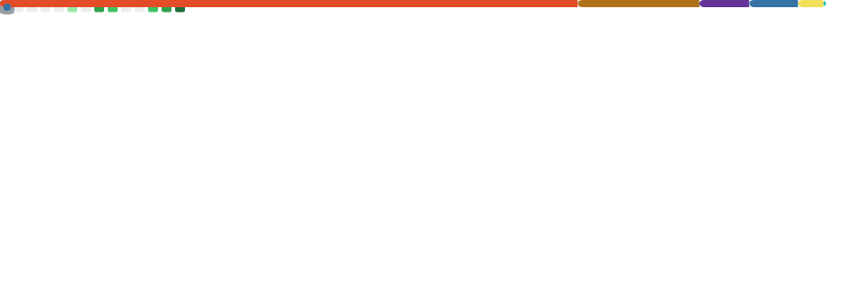

<p align="center">
  
</p>

<div align="center">
  

  <p>
    
  </p>

  <a href="https://arthurschgg-portfolio.vercel.app" target="_blank"></a>
  <a href="https://www.linkedin.com/in/arthur-miguel-schlichting-5b360b2b3/" target="_blank"></a>
  <a href="mailto:arthurms2904@gmail.com"></a>
  <a href="https://wa.me/5547997695223" target="_blank"></a>
</div>

<br/>

---

### 📑 SYSTEM_CORE

> Estudante de Sistemas na CentroWEG. Formado em Técnico em Desenvolvimento de Sistemas pelo SENAI/SC. Trabalho principalmente com Java e Python, arquitetura MVC e automação.

```yaml
formation: "Técnico em Desenvolvimento de Sistemas — SENAI/SC [CONCLUÍDO]"
current: "Sistemas de Informação — CentroWEG [EM ANDAMENTO]"
focus: ["Java", "Python", "MVC", "Automação"]
```

---

### 💻 TECHNICAL_RESOURCES

<br/>

<div align="center">
  <table border="0" style="border-collapse: collapse;">
    <tr>
      <td align="left" style="padding-right: 40px;">
        <strong>◈ LANGUAGES_CORE</strong><br/>
        
      </td>
      <td align="left">
        <strong>◈ WEB_LAYER</strong><br/>
        
      </td>
    </tr>
    <tr>
      <td align="left" style="padding-top: 20px; padding-right: 40px;">
        <strong>◈ DATA_AND_DEVOPS</strong><br/>
        
      </td>
      <td align="left" style="padding-top: 20px;">
        <strong>◈ HARDWARE_AND_NETWORK</strong><br/>
        
        
      </td>
    </tr>
  </table>
</div>

<br/>

---

<div align="center">

  

  <br/><br/>

  <a href="https://www.codewars.com/users/arthurSchgg" target="_blank">
    
  </a>

  <br/><br/>

  
  

  <br/><br/>

  

</div>

<br/>

<div align="center">
  
  <br/>
  
</div>

<p align="center">
  
</p>
